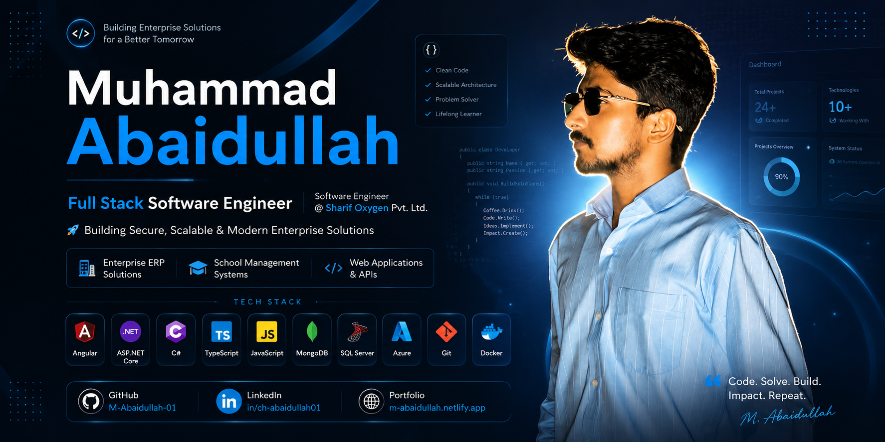
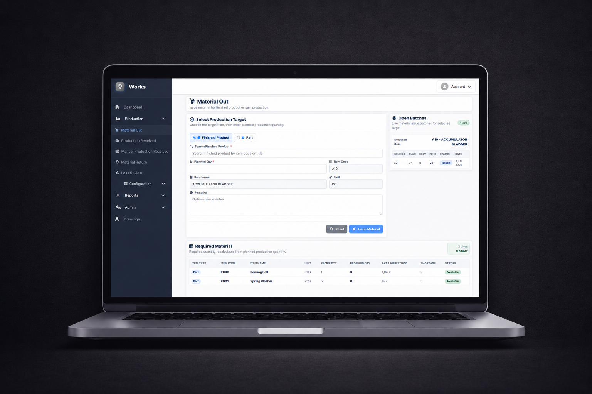
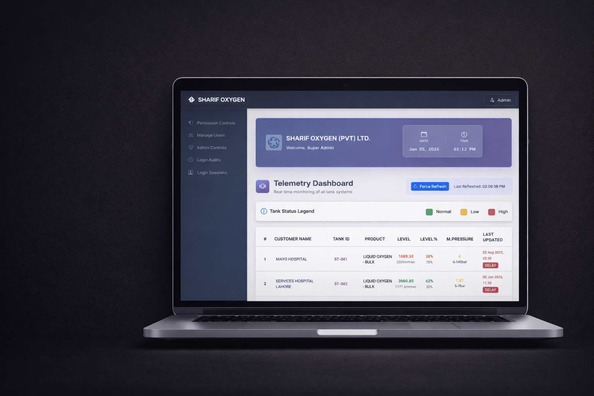
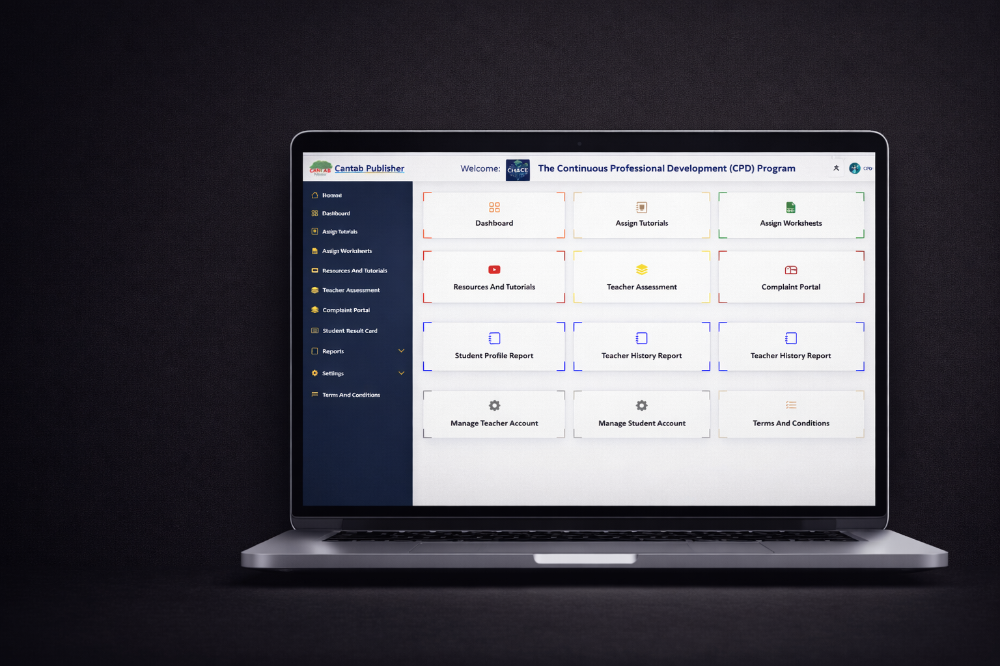
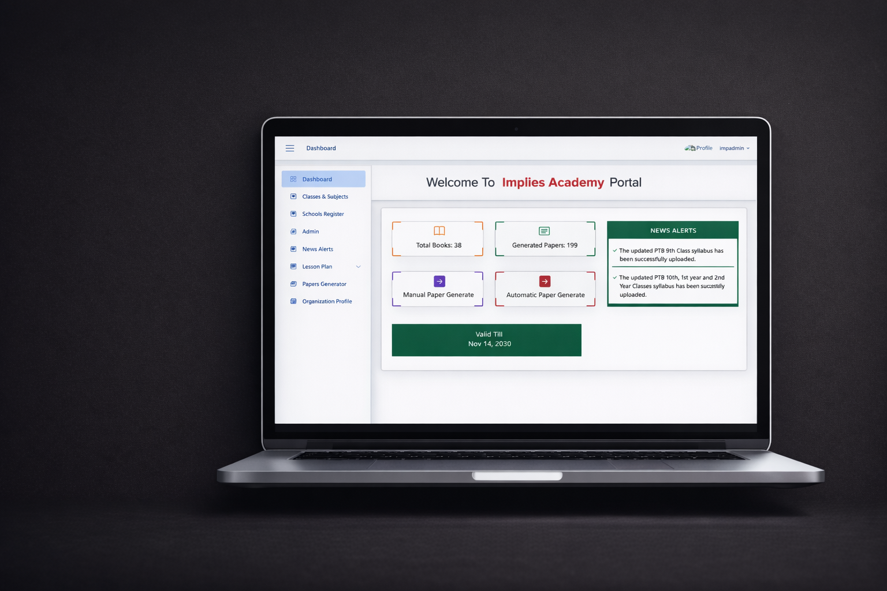

<h1 align="center">Muhammad Abaidullah</h1>
<h3 align="center">Full Stack Software Engineer</h3>

Building secure, scalable and modern enterprise solutions.

  
  
  
  

---

## Professional Summary

Full Stack Software Engineer based in Lahore, Pakistan, focused on enterprise web applications, ERP systems, inventory and production management, telemetry systems, school management and digital assessment platforms, secure architecture and role-based access control.

| Current | Former | Education |
|---|---|---|
| Software Engineer at **Sharif Oxygen Pvt. Ltd.** | Full Stack Developer at **Implies Solutions** | Bachelor's degree in Information Technology, **University of the Punjab** |

## Technology Stack

| Area | Technologies |
|---|---|
| Frontend | Angular, TypeScript, JavaScript, HTML5, CSS3 |
| Backend | ASP.NET Core, C#, REST APIs |
| Databases | MongoDB, MySQL, SQL Server |
| Cloud & DevOps | Microsoft Azure, Docker, Git, GitHub |
| Tools | Visual Studio, VS Code, Postman, Figma |

## Featured Projects

<table>
  <tr>
    <td width="45%"></td>
    <td width="55%"><h3>Works ERP</h3><strong>Workshop Inventory &amp; Production Management System</strong> An enterprise platform for inventory, production, material issuance, drawings, stock ledgers and operational reporting. <strong>Key capabilities:</strong> Inventory, production tracking, material flow, reports. <strong>Technologies:</strong> Angular, ASP.NET, C#, MySQL</td>
  </tr>
  <tr>
    <td width="45%"></td>
    <td width="55%"><h3>Sharif Oxygen Telemetry &amp; Fleet Management System</h3>A real-time monitoring platform for oxygen tanks, fleet operations, status indicators and centralized reporting. <strong>Key capabilities:</strong> Telemetry dashboards, tank monitoring, fleet operations, analytics. <strong>Technologies:</strong> Angular, ASP.NET Core, C#, SQL Server, Azure</td>
  </tr>
  <tr>
    <td width="45%"></td>
    <td width="55%"><h3>SchoolVisions360</h3><strong>School Management &amp; Digital Assessment System</strong> A multi-role academic platform for school administration, classes, attendance, examinations and reporting. <strong>Key capabilities:</strong> Admin portals, academics, attendance, exams, reports. <strong>Technologies:</strong> Angular, ASP.NET, C#, MySQL</td>
  </tr>
</table>

### Additional Project

<table>
  <tr>
    <td width="18%"></td>
    <td width="82%"><strong>Paper Management System</strong> A digital assessment solution for question-bank management, manual and automated paper generation, assignments, submissions and performance reporting. <strong>Technologies:</strong> Angular, ASP.NET, C#, MySQL</td>
  </tr>
</table>

## Experience Timeline

| Role | Focus |
|---|---|
| **Software Engineer - Sharif Oxygen Pvt. Ltd.** | Developing enterprise systems for telemetry, fleet operations, inventory, production and reporting. |
| **Full Stack Developer - Implies Solutions** | Built and enhanced Angular and ASP.NET enterprise web applications. |
| **Web Application Developer Intern - Implies Solutions** | Contributed to practical Angular and .NET development workflows. |
| **Full Stack Development Apprentice - Tech Hub Shahdrah** | Completed hands-on training in web application development. |

## GitHub Analytics

  
  

## Current Focus

- Secure enterprise applications
- ERP and production-management systems
- Scalable School Management Systems
- Cloud deployment and DevOps practices

## Contact

  
  
  

<strong>Code. Solve. Build. Impact. Repeat.</strong>

